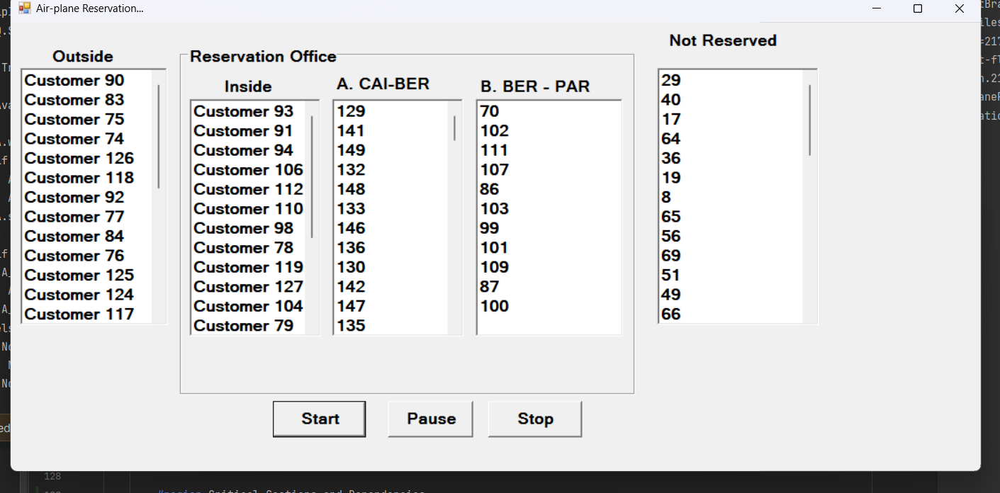

# Airplane Reservation Simulation by Semaphores

This Task is a simulation of an airplane reservation system implemented using semaphores in C#. It demonstrates how semaphores can be used to manage concurrent access to shared resources.

## ok computer

## Solution

```           
**CUSTOMERS**                                                  **CLERKS**

// get Id and Trip                                            ReadyCustomer.Wait()
 Id,TripId
 
 OutSide.Wait()                                               Id,TripId
  OutSideList.Add(Id)                                         
 OutSide.Signal()                                             IDQ.Wait()
                                                               Id = CustomerIDQ.Dequeue()
 Capacity.Wait() //20                                          TripId = TripIDQ.Dequeue()
                                                              IDQ.Signal()
   OutSide.Wait()
    OutSideList.Remove(Id)                                    if TripId == A 
   OutSide.Signal()                                               Available = false
                                                                  A.wait()
   InSide.Wait()                                                    if Available_A > 0
    InSideList.Add(Id)                                                    Available_A--
   InSide.Signal()                                                        Available = true
                                                                  A.signal()

   IDQ.Wait()                   
    CustomerIDQ.Add(Id)                                       if Available
    TripIDQ.Add(TripId)                                           A_Qu.Wait()
   IDQ.Signal()                                                      A_Qu.Add(id)
                                                                  A_Qu.Signal()
   ReadyCustomer.Signal()                                     else
                                                                  NotServedQu.Wait()
   Served[Id].Wait()                                                NotServedQu.Add(id)
                                                                  NotServedQu.Signal()
   InSide.Wait()                            
    InSideList.Remove(Id)                                    Served[Id].Signal()
   InSide.Signal()
   
 Capacity.Signal()
```
 [See actual Code](https://github.com/Shehapp/concurrency/blob/main/AirplaneReservation/Form2.cs#L85)
## Contributing

If you find any issues or have suggestions for improvements, please open an issue or submit a pull request.