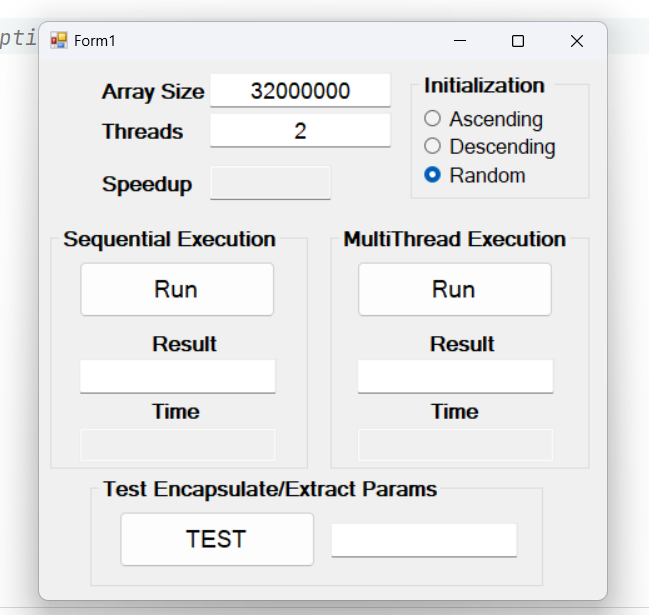
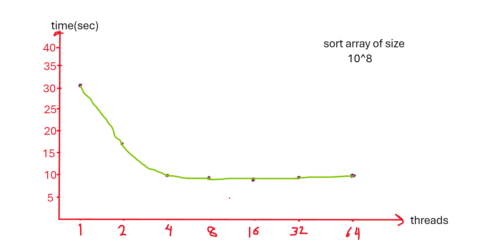

# Multithreaded Merge Sort

## How?
This assignment involves creating a multi-threaded implementation of the merge sort algorithm in C#, utilizing semaphores. You have the flexibility to specify the number of threads for the merge sort operation.

## Runtime :(
You may observe a reduction in processing time until it reaches 8 threads, at which point there is no further improvement. This is because my PC has 8 cores.

## Contributing

If you find any issues or have suggestions for improvements, please open an issue or submit a pull request.
