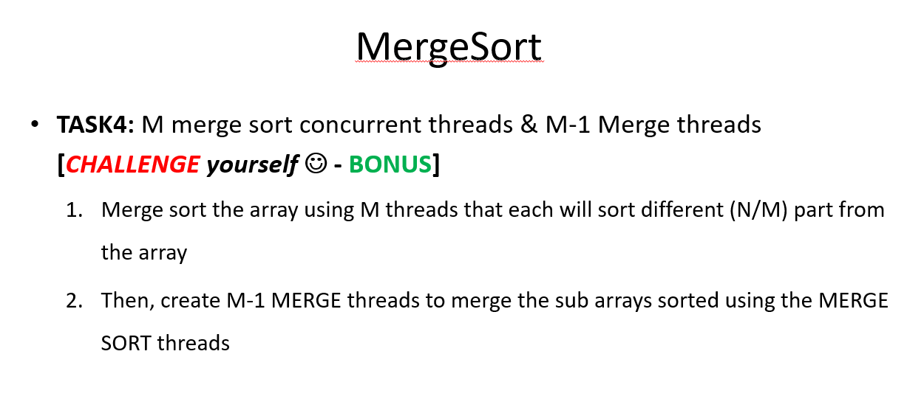
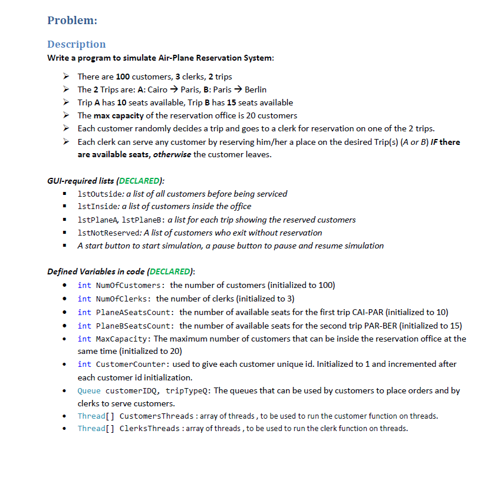

# Concurrency Problems Solved with Semaphores

## Merge Sort

[readme](https://github.com/Shehapp/concurrency/blob/main/Merge-Sort/README.md)
  
## Plane Reservation

[readme](https://github.com/Shehapp/concurrency/blob/main/AirplaneReservation/README.md)

## a bunch of bad Leetcode problems
[Leetcode problems](https://leetcode.com/tag/concurrency/)

  
